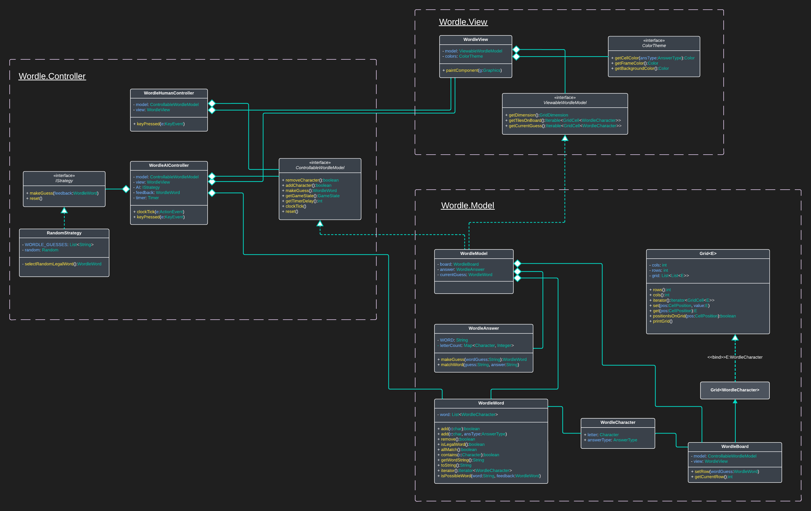
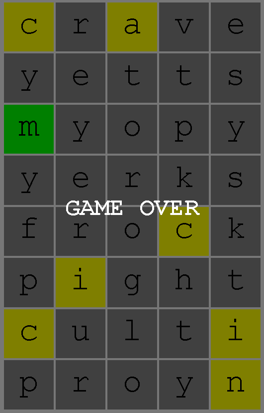
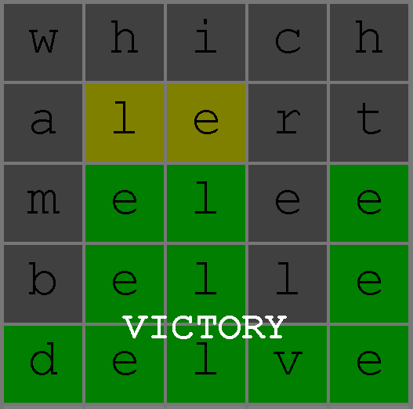
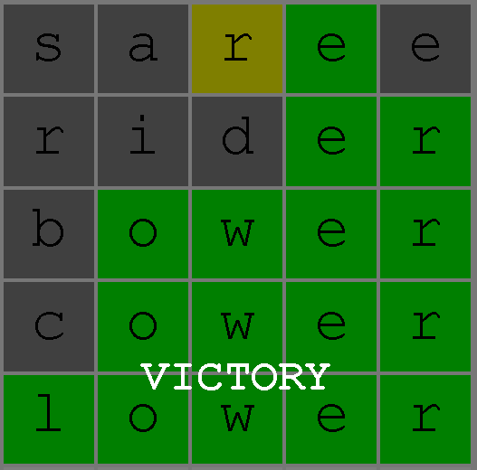
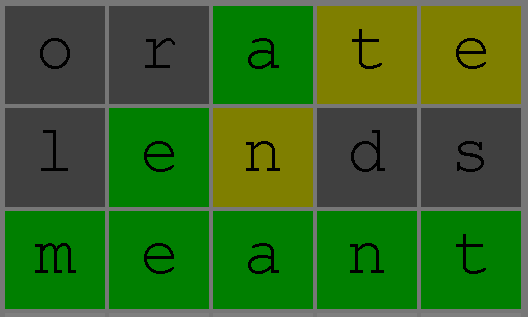

# Wordle - Semester assignment 1


In this assignment you will implement **Wordle**. The goal of the game is to guess a hidden 5 letter word. For each guess you receive information about whether the letters used were correct and in the correct position. For each guess, each letter in the guess will be assigned a color:
 * Green: The letter is correct (it matches the one in this position in the secret word)
 * Yellow: The letter appears in the secret word, but not in this position, in some other position which is not a green position.  
 * Gray: The letter is not in the secret word (or all occurrences of this letter in the secret word have already been accounted for by other green or yellow tiles)

The example on the right shows a game in progress where the word to guess was *Sunny*.
When guessing a word it has to be a word from the English dictionary.
It is quite hard to guess a word if the secret word is something you've never heard of, therefore the answer will be a relatively common word.
Wordle has two lists of words, one contains (close to) all the words in the English dictionary (n=12,972), the other contains the common words that can be the answer (n=2316).

Your job is to finish the game's implementation and create an AI which can play the game.

To get a feel for the game you can play it here: [https://wordlegame.org/](https://wordlegame.org/)

All code you submit will be evaluated on five points:
 - **Functional correctness**. Does the program do what it is supposed to do?
  - **Quality of AI**. How well can your AI play the game?
 - **Runtime**. Have you found an efficient solution to the program?
 - **Runtime analysis**. For each method you code for the first 3 tasks, you will need to add a comment about which Big-O runtime it has.
 - **Code quality**. Is you code readable and maintainable?

**IMPORTANT**: When implementing the code you must give a runtime analysis in [svar.md](svar.md).

A more detailed explanation of how your submission will be evaluated can be found at the bottom of this README.

 <br clear="right"/>
 
## Overview
This program uses the Model-View-Controller design pattern similar to that of Tetris from INF101.

The most important classes of this program are:
 - `WordleCharacter` represents a single letter in a guess word. It has two field variables:
   - `letter`: the letter the user has entered/written
   - `answerType`: CORRECT, MISPLACED, WRONG or BLANK. This is what informs the user of whether their guess was good or not.
 - `WordleWord` represents a guess word. It is an Iterable of `WordleCharacter`. It is composed of 5 characters.
 - `WordleAnswer` is the class that contains the secret word that the user needs to guess.
 - `WordleWordList` is the class that contains all the words that the user can choose and all the words that can be the answer.

Here is a UML diagram of the most important classes:




# Part 1 - Finish the game
The program for Wordle can run as it is, but it is missing one crucial method to make it fun to play. 

## Task 1 - matchWord
The missing method is `matchWord`, which checks the guess word and gives feedback on which letters were correct.

**TODO: Implement `WordleAnswer::matchWord`.**

This method takes in a `WordleWord` object which is the word the user has guessed. It should return a new `WordleWord` object which has feedback on the guess, i.e. CORRECT, MISPLACED or WRONG.

The rules for the feedback (as stated in the first paragrahp of the README) should be unambigous when the user guesses a word with all different letters. For instance, if the answer word is **abide** and the user guessed **adept** the feedback should be:


 - `a`: CORRECT
 - `d`: WRONG_POSITION
 - `e`: WRONG_POSITION
 - `p`: WRONG
 - `t`: WRONG

If the word you guess or the answer contains multiple letters of the same type you must first color all green tiles, then among the ones not colored green, you color yellow tiles starting from the left. If the number of tiles colored yellow or green is equal to the number of times the letter occur in the answer, the remaining occurrences in the guess will be colored grey.

Run `WordleAnswerTest.java` to see if your implementation is correct. When the tests pass, you should be able to play the game by running `WordleMain.java`.

> Hint: The code you write in Task 1 should be reused for all the other tasks. You should not implement the logic from `matchWord` several times.

There are some tests for efficiency in `WordleAnswerTest.java`, if these pass it is likely you have found an efficient solution.
But even if your code is efficient on the sample input there could be other inputs where it is not, therefore we want to know the worst case runningtime.
In this case you should use `k` - the number of letters in the words to analyze your running time

**TODO: analyze the runtime of `WordleAnswer::matchWord` and write your answer in [svar.md](svar.md).**

To get full score on this task, your code must be efficient and the runtime analysis must be correct.

# Part 2 - Artifical Intelligence 
Now that we have a functional game it is time to create some players which are better than a human.

## RandomStrategy



We have already implemented an AI: [RandomStrategy](./src/main/java/no/uib/inf102/wordle/controller/AI/RandomStrategy.java).

This strategy simply guesses a random word every time, until it finds the secret word, disregarding the feedback it receives. This is a very bad strategy and most times you get GAME OVER instead of VICTORY.

Even though there was no plan to the guesses in the picture to the right we can figure out that the word probably was "manic".
If the AI kept the information that was obtained and only guessed words that fit with all the previous answers it would do much better.

**In the remaining tasks we will create more intelligent solutions.**

 <br clear="right"/>
 
## Task 2 - EliminateStrategy


This strategy seeks to eliminate all non possible words based on the feedback we get from our previous guesses. For the purposes of this strategy we see it as useless to guess a word that contains letters that is not in the secret word.

In order to improve the AI you need to make use of the information you get when you make a guess. The way to do this is to look through all the possible words an answer can be and eliminate the ones that do not match with the feedback you were given.

**TODO: Implement `WordleWordList::eliminateWords`.**

> Hint: It will be important to know which methods exist in the important classes mentioned in the section Overview above.

Once you get the tests for EliminateWords in `WordleWordListTest` to work you are ready to test your AI.
`WordleMain` runs one game and displays the result in a graphical user interface. Currently the RandomStrategy AI is used, you will have to edit `WordleAIController` to register your new AI as the one to be used

```java
//this.AI = new RandomStrategy();
this.AI = new EliminateStrategy();
```
 
 You should also test your new AI using [Performance5Letters](./src/main/java/no/uib/inf102/wordle/controller/AI/Performance5Letters.java)
 
 You can add more strategies to the AIPerformance class later

 If you have implemented EliminateStrategy correctly your AI should on average use about 4.1 guesses.
 <br clear="right"/>
 
 The method `WordleWordList::eliminateWords` depends on the state of the EliminateStrategy object, i.e. what you have guessed and the feedback you get.
 To analyze the runtime of this method we need to consider several variables.
 
   * `n` - number of words in the list `allWords`
   * `m` - number of words in the list `possibleWords`
   * `k` - number of letters in the wordle words
   
**TODO: analyze the runtime of `WordleWordList::eliminateWords` and write your answer in [svar.md](svar.md).**
 
 
## Task 3 - FrequencyStrategy



We noticed in the example from the previous question, that Eliminate strategy sometimes guessed words with uncommon letters. "which" had no hits because w and h are relatively uncommon letters. 
366 words starts with 's' while only 83 words starts with 'w' and 424 ends with 'e' while only 139 ends with 'h'. If we start with a smarter word like "aurei" we would eliminate more.
By selecting words with common letters we ensure that if we get a grey tile we eliminate as many words as possible.

Using "which" as our first word leaves us with a high probability of getting all grey tiles, and if that happens we are left with 1023 words that are still possible. Starting with "aurei" gives us a higher probability of green, and if we get all grey tiles, it only leaves us with 114 possible words.

In this task, you are to complete the FrequencyStrategy AI.

**TODO: Implement `FrequencyStrategy::makeGuess`.**

You need to find the word that has the highest expected number of green matches among the words that are still possible answers at the given stage of the game. We assume that the answer is selected randomly and thus all possible words are equally likely.

> Hint: You might want to make some helper methods that can be reused in future AI strategies.

If you have implemented FrequencyStrategy correctly, `FrequencyStrategyTest` should pass. 
You should add FrequencyStrategy to [AIPerformance](./src/main/java/no/uib/inf102/wordle/controller/AI/AIPerformance.java) by commenting in the right line.
When you run [Performance5Letters](./src/main/java/no/uib/inf102/wordle/controller/AI/Performance5Letters.java) you should see that FrequencyStrategy does slightly better and you should on average use about 3.9 guesses.

**TODO: analyze the runtime of `FrequencyStrategy::makeGuess` using `n`,`m` and `k`, write your answer in [svar.md](svar.md).**

<br clear="right"/>

## Task 4 - Make your own (better) AI

Even though FrequencyStrategy performs better than EliminateStrategy, it is far from the optimal solution. There are plenty optimizations that can be done in order to make an even better AI.
Although on the example of 5 letter words from the English dictionary FrequencyStrategy does quite well, there are other sets of words it does far worse on.

**TODO: Implement your own AI, `MyStrategy`, that performs better than FrequencyStrategy, describe your algorithm in svar.md**

Note that we do not ask you to find the optimal strategy for Wordle.



Run [Performance_ill](./src/main/java/no/uib/inf102/wordle/controller/AI/Performance_ill.java) to see how the different Strategies perform on this dataset.

> Hint: If you study the way FrequencyStrategy from Task 3 plays, you will see that once a letter turns green every guess after that will use that letter. We could have used those guesses to gain information if we instead chose words that are not possible answers.

> Hint: You also notice that the AI uses words with two instances of the same letter, and often both of these end up being colored grey. You will not gain any information from the second letter if both letters are colored grey.

Normally when we are faced with hard problems like this there is a tradeoff between the time needed to get an answer and the quality of that answer.
We want you to understand this tradeoff. Both time and performance will be considered when we grade your work.
 
In this task you are free to choose how to develop your AI, but there are some constraints you need to meet to get full score.

1. The AI must be able to complete the 100 games in AIPerformance within about 30 second.
2. The expected number of guesses must be significantly lower than that of FrequencyStrategy.
3. The AI needs to work well for other larger lists of possible answers than the default list used in this code. Hardcoding words will therefore result in a low score.
4. The main ideas of your strategy need to be described in [svar.md](svar.md).

Above you see an example of how a better AI could play the game.
The score you get on this task partly depend on the average number of guesses.

<br clear="right"/>


## Grading
This mandatory assignment will count 12 % towards your final grade. You will recieve a score between 0 and 12.
The following rubric will be used to assess your assignemnt:

### Code Quality
Code quality is worth 2 points.
 * The code must be clear and readable
 * Avoid repetition of code
 * Utilize concepts from INF101 to write maintainable and modular code
 * Your code is properly documented

### Runtime Analysis (svar.md)
Runtime analysis is worth 2 points.
 * The three methods you are to implement, `WordleAnswer::matchWord`, `WordleWordList::eliminateWords` and `FrequencyStrategy::makeGuess` must have a runtime analysis using Big-O notation. You also need to show how you analyzed any methods used by these three methods.
 * The runtime analysis must be written in svar.md. In addition to Big-O notation you must include a description of why the method has this runtime. If you just write a short summary in svar.md and the analysis is done in comments in the code, that is fine as long as it is clear where we can find the analysis.

The runtime should be expressed using these three parameters:
   * `n` - number of words in the list `allWords`
   * `m` - number of words in the list `possibleWords`
   * `k` - number of letters in the wordle words

Note that not all of these parameters will be relevant to all methods. Some methods might just be dependent on one or two of the parameters.

### Functional and Efficient Algorithms and Datastructures
Correct and appropriate use of algorithms and datastructures is worth 8 points.
Each task asks you to write some code that both solves the problem yielding the best result possible, i.e. as few guesses as possible, and that runs as efficiently as possible. In this task you will need to use algorithms and/or datastructures you have learned in this course, for instance: `LinkedList`, `ArrayList`, `HashMap`, `HashSet`, `PriorityQueue`, etc. We will look at every method you have implemented and assess if you have done this as efficiently as possible.
 * **Task 1, 2 & 3** is worth 1.5 points each (4.5 points in total).
    * We will assess if your implementation is functionally correct
    * We will assess whether the methods and classes implemented to complete the task are written as efficiently as possible
 * **Task 4** is worth 3.5 points.
    * We will assess if your implementation is functionally correct
    * We will assess whether the methods and classes implemented to complete the task are written as efficiently as possible
    * We will assess whether your solution outperforms `FrequencyStrategy` and how much better it is.
